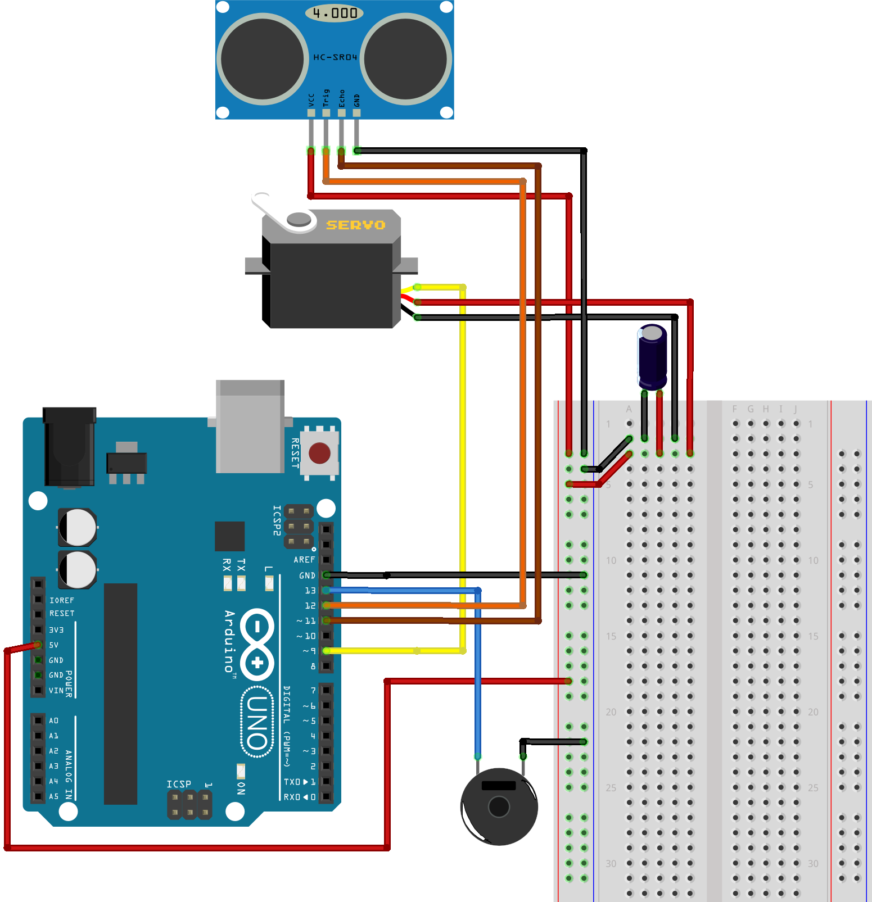
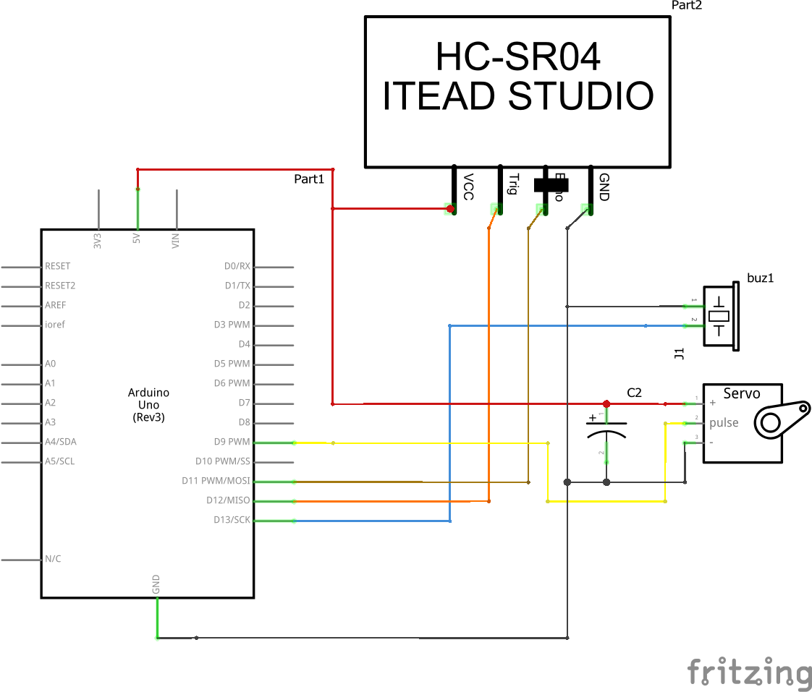

# ArduinoRadarScanner
Radar scanner that moves side to side to detect objects. 

If an object comes within 15cm of the scanner it will stop moving and the buzzer will go off.   

Components Used:
- Ultrasonic Sensor (HC-SR04)
- Servo Motor
- Active Buzzer

## Demo

https://github.com/user-attachments/assets/0c0471d8-9aa8-4cfd-a81b-ead251467d81
## Breadboard

## Schematics

